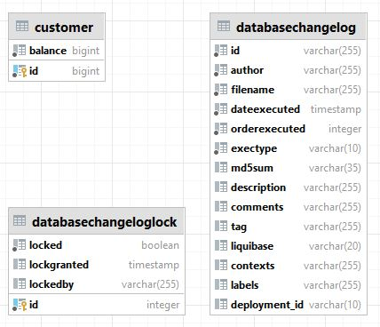

# FinalCoundown
Финальный проект на курсе Java
  


### Архитектура проекта
Сервис представляет собой REST API для Интернет-банка  
Сервис основан на Spring Boot 2.7.5 и системе сборки maven
### Сборка проекта
```mvnw clean install```
### Описание функциональности
На данный момент приложение обладает следующей функциональностью:  
`GET /customer/balance/get` - получить текущий баланс пользователя;  
`PUT /customer/balance/takeMoney` - снятие заданной суммы с баланса пользователя;  
`PUT /customer/balance/putMoney` - пополнение баланса пользователя на заданную сумму.  

### База данных  
Используется база данных PosgreSQL  
Для запуска проекта необходимо заполнить поля url, username и password в файле application.yaml  
Структура базы данных на данном этапе представляет собой одну рабочую таблицу customer и две 
вспомогательные таблицы миграции:  
  
### Миграция базы данных
Для отслеживания, управления и применения изменений схемы базы данных использована библиотека liquibase
### CI/CD
В качестве CI/CD используется GithubAction  
При коммите в любую ветку будет
запущен процесс сборки сервиса
### API documentation
Для автоматической генерации API документации использована библиотека springdoc-openapi v1.6.12  

