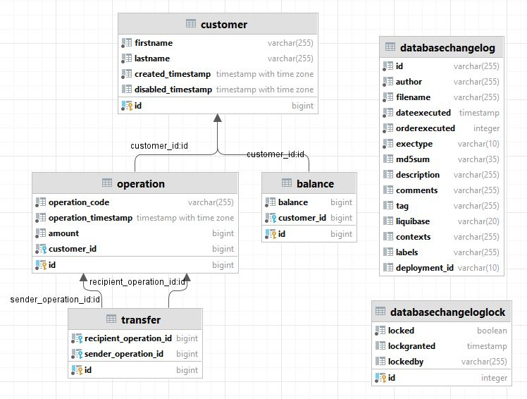

# FinalCountdown
Финальный проект на курсе Java
  


### Архитектура проекта
Сервис представляет собой REST API для Интернет-банка  
Сервис основан на Spring Boot 2.7.5 и системе сборки maven
### Сборка проекта
```mvn clean install```  
Перед сборкой проекта необходимо заполнить данные для подключения к БД (поля url, username и password) в файле application.yaml
### Запуск проекта локально
```mvn spring-boot:run```
### Описание функциональности
На данный момент приложение обладает следующей функциональностью:  
`POST /customer/add` - добавить пользователя;  
`GET /custimer/find` - поиск пользователя по id;  
`PUT /customer/updatenames` - изменить имя и фамилию пользователя по id;  
`DELETE /customer/delete` - удалить пользователя по id;  
`GET /balance/get` - получить текущий баланс пользователя;  
`PUT /balance/take` - снятие заданной суммы с баланса пользователя;  
`PUT /balance/put` - пополнение баланса пользователя на заданную сумму;
`PUT /balance/transfer` - перевод суммы от одного пользователя другому;  
`GET /operation/getList` - получение списка произведенных операций с балансом.  
Более подробная информация доступна после развертывания сервиса по адресу:   
```http://<HOST>:<PORT>/swagger-ui/index.html#/```
### База данных  
Используется база данных PosgreSQL  
Структура базы данных:  

### Миграция базы данных
Для отслеживания, управления и применения изменений схемы базы данных использована библиотека liquibase
### CI/CD
В качестве CI/CD используется GithubAction  
При коммите в любую ветку будет
запущен процесс сборки сервиса
### API documentation
Для автоматической генерации API документации использована библиотека springdoc-openapi v1.6.12
### Docker
В репозитории хранится Dockerfile для упаковки сервиса в образ на основе openjdk:17-alpine  
Кроме того хранится docker-compose.yaml для развертывания образа совместно с образом postgres:15.0-alpine
### Демонстрация работы сервиса
Сервис развернут на хостинге и доступен по адресу:
```92.63.98.246:8080```
